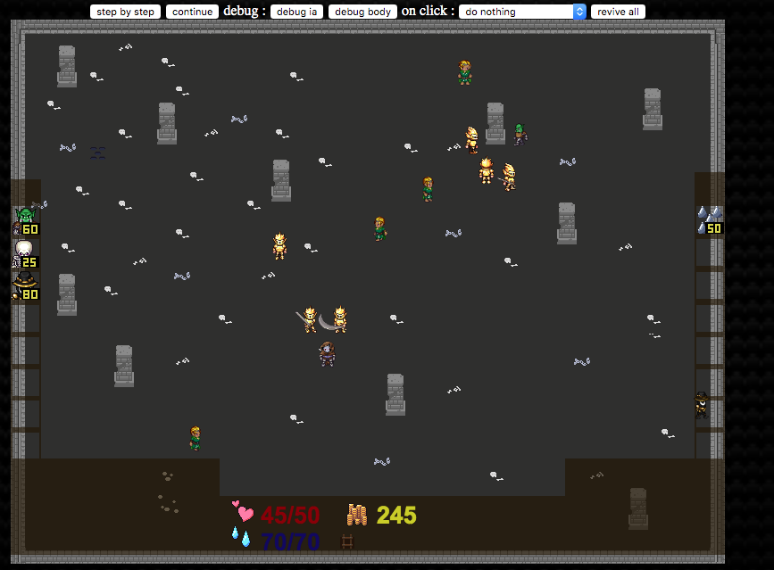

# Dread Maze

Protect the dungeon !

**First step:** Recruit your monsters and place your traps. Be quick !

**Second step:** Survive the invasion of thirsty adventurers seeking for the treasure.  
You have to kill them all ! But if your main character dies, it's Game Over.

## How to launch

You need to launch an http server at the root of the project.  
For example, you can use `python3 -m http.server`.

Then open the page `http://localhost:port/game.html`,
with `port` being the port on which the http server has started.
